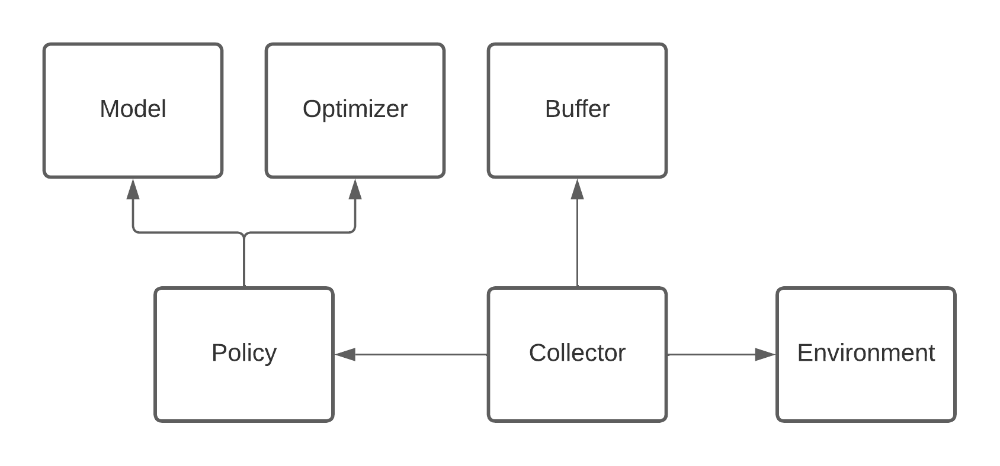
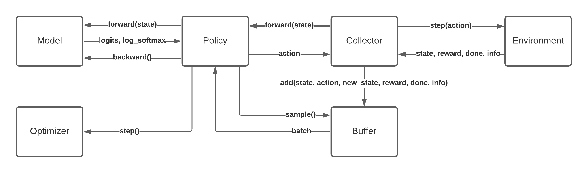
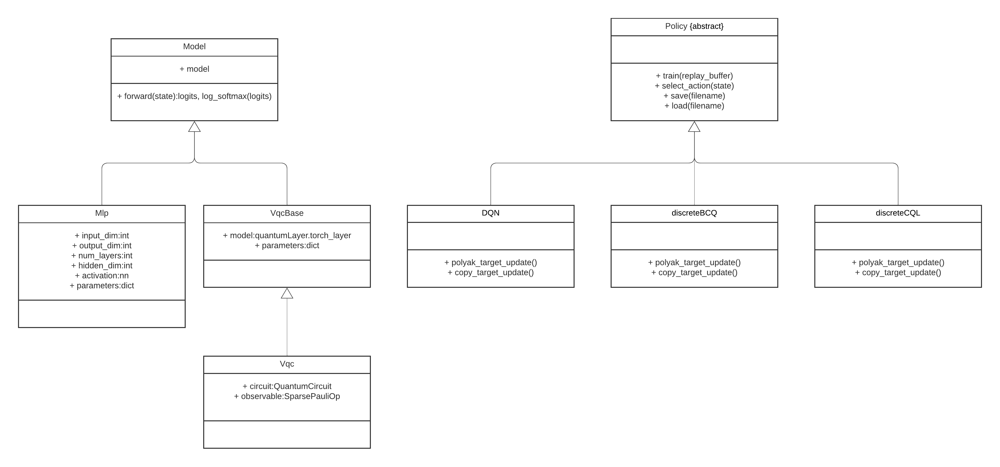

# OfflineQRL
Offline Quantum Reinforcement Learning (QRL) Framework.

Algorithms:
- Conservative Quantum Q-learning (CQ2L): https://ojs.aaai.org/index.php/AAAI/article/view/25872
- Batch-Constraint Quantum Q-Learning (BCQQ): https://arxiv.org/pdf/2305.00905.pdf

Environments:
- OpenAI CartPole

## Commands
Examples of how to use the framework.

Fill buffer by speficying a config file containing the environment config (-c), path to a directory to save buffer (-b) and number of steps to collect (-s):
```
python main.py -m fill_buffer -c ./config/hardware_cart_pole_classical_BCQ.yml -b ./buffers -s 10000
```

Alternatively, by specifying a path to an experiment with a trained policy (-p), path to a directory to save buffer (-b) and number of steps to collect (-s):
```
python main.py -m fill_buffer -p ./experiments/Classical_DQN_HardwareCartPole -b ./buffers -s 75
```

Train offline policy by setting mode (-m) to offline, configuration specifying algorithm etc (-c) and buffer to train on (-b):
```
python main.py -m offline -c ./config/hardware_cart_pole_hybrid_BCQ.yml -b ./buffers/HardwareCartPole_DQN_1000_20240111-104539.npz
```

To continue training from a checkpoint specify path to checkpoint (-r):
```
python main.py -m offline -c ./config/cart_pole_classical_BCQ.yml -b ./buffers/cart_pole_single_trajectory_100_steps20231005-092357.npz -r ./experiments/discreteBCQ_CartPole_20231214-15285120231214-152851/checkpoints/checkpoint_2100.pth
```

Train online behavior policy by setting mode (-m) to online and configuration specifying algorithm etc (-c):
```
python main.py -m online -c ./config/cart_pole_classical_DQN.yml
```

To evaluate an offline policy specify mode (-m) offline_eval, number of evaluation episode (num_eval_eps) and path to model checkpoint (-r):
```
python main.py -m offline_eval --num_eval_eps 2 -r ./experiments/Hybrid_discreteBCQ_HardwareCartPole_20240110-14224720240110-142247/checkpoints/checkpoint_70.pth
```

To evaluate an online policy specify mode (-m) online_eval, number of evaluation episode (num_eval_eps) and path to model checkpoint (-r):
```
python main.py -m online_eval --num_eval_eps 2 -r ./experiments/Classical_DQN_HardwareCartPole/checkpoints/checkpoint_9800.pth
```
## Customization
In order to implement your own VQCs, inherit from VqcBase and implement your circuit architecture and observables in a class (see e.g., src/models/skolikVqc).

Furthermore, to add additionaly algorithms create a class that inherits from Policy and overwrite the corresponding abstract methods.

## Dependencies

## Call Diagram

## Class Diagram


## License
Apache 2.0 License